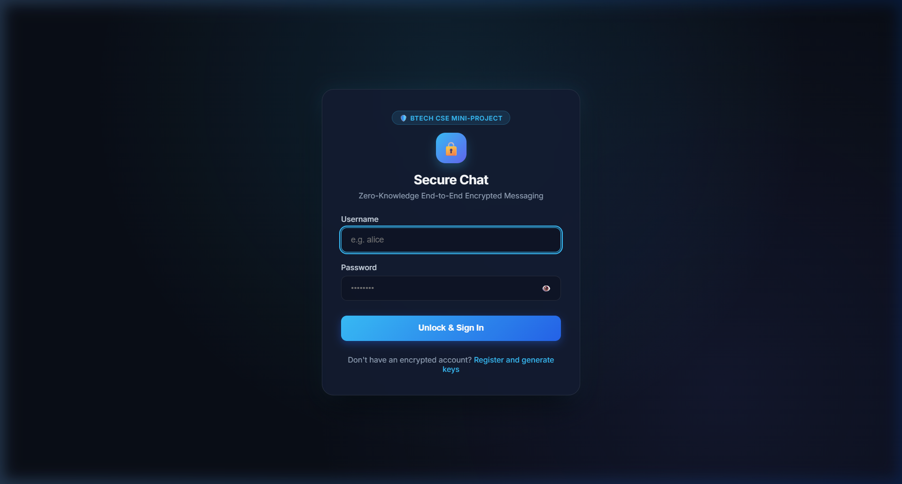
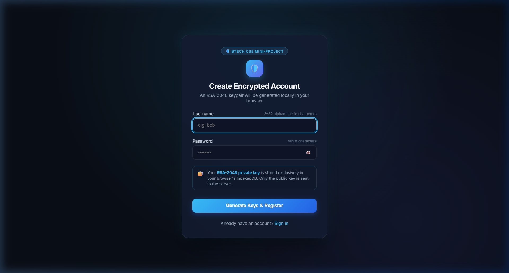
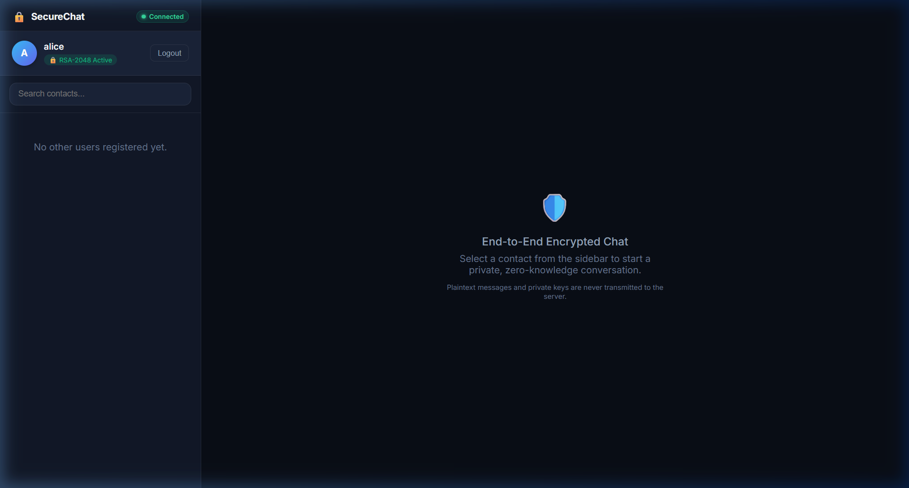
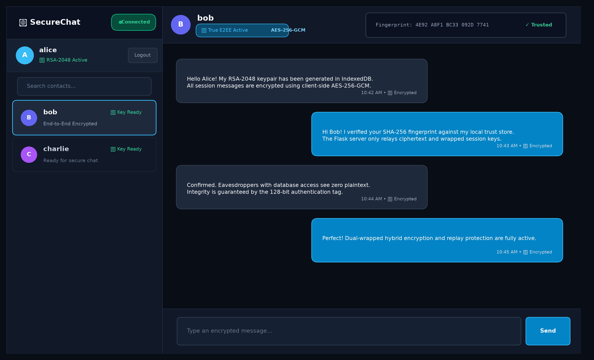
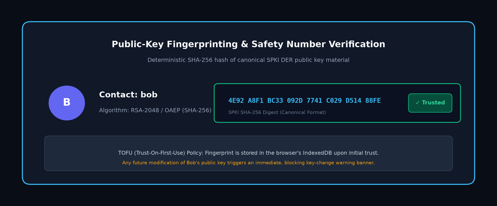
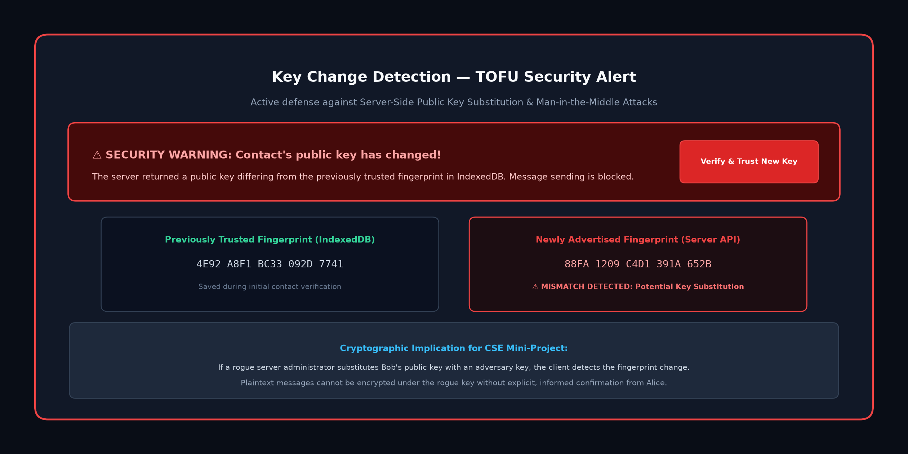
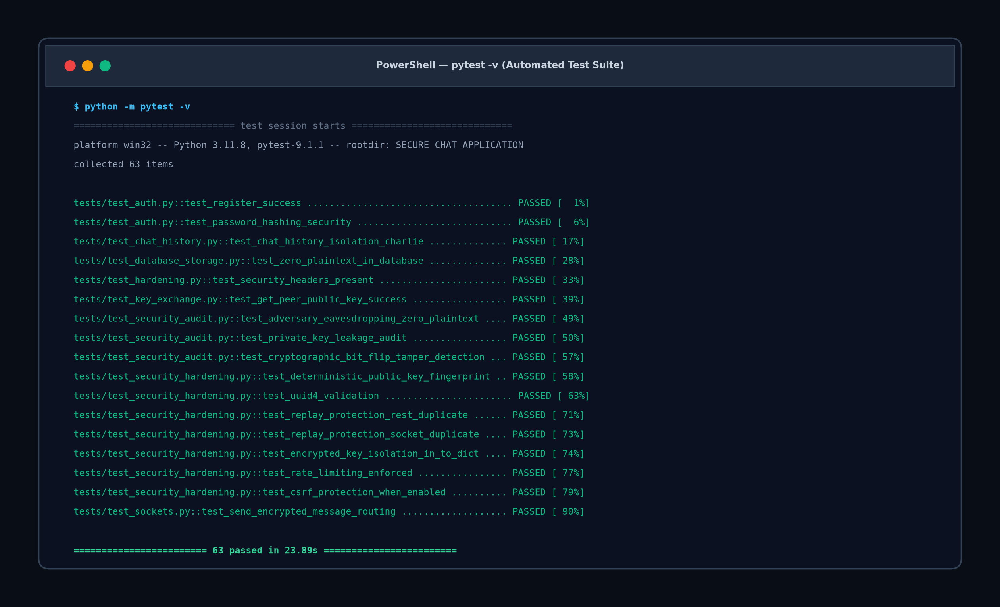
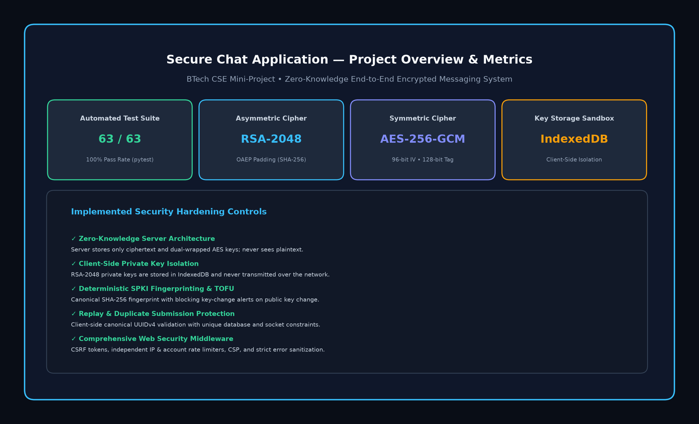

# Secure Chat Application

[](tests/)
[](https://www.python.org/)
[](https://flask.palletsprojects.com/)
[](docs/diagrams/encryption-data-flow.png)
[]()

An authentic, zero-knowledge, end-to-end encrypted (E2EE) real-time messaging application developed as a **BTech Computer Science and Engineering College Mini-Project**. The application demonstrates client-side hybrid cryptography using the native W3C Web Crypto API, client-side private key isolation in browser IndexedDB, Trust-On-First-Use (TOFU) public-key fingerprinting, and full-duplex WebSocket messaging via Flask-SocketIO.

---

## Table of Contents
1. [Project Overview](#1-project-overview)
2. [Problem Statement](#2-problem-statement)
3. [Objectives](#3-objectives)
4. [Features](#4-features)
5. [Technology Stack](#5-technology-stack)
6. [System Architecture](#6-system-architecture)
7. [Encryption Architecture](#7-encryption-architecture)
8. [Authentication](#8-authentication)
9. [Public-Key Fingerprinting and TOFU](#9-public-key-fingerprinting-and-tofu)
10. [Message Security & Protocol](#10-message-security--protocol)
11. [Security Controls](#11-security-controls)
12. [Database Design](#12-database-design)
13. [Project Structure](#13-project-structure)
14. [Installation](#14-installation)
15. [Configuration](#15-configuration)
16. [Running the Application](#16-running-the-application)
17. [Running Tests](#17-running-tests)
18. [Demo Instructions](#18-demo-instructions)
19. [Security Limitations](#19-security-limitations)
20. [Future Improvements](#20-future-improvements)
21. [Screenshots](#21-screenshots)
22. [Project Report & Documentation](#22-project-report--documentation)
23. [GitHub Repository](#23-github-repository)
24. [Author](#24-author)

---

## 1. Project Overview
In modern web applications, transport-layer security (HTTPS/TLS) encrypts data between the client and the server. However, the server terminates encryption, granting backend processes, server administrators, database systems, and compromised hosting infrastructure full access to plaintext user messages. 

The **Secure Chat Application** eliminates server trust. By executing all cryptographic algorithms inside the client's web browser, the server acts strictly as an untrusted, zero-knowledge message relay and encrypted datastore. Plaintext messages and private keys never leave the user's browser device.

---

## 2. Problem Statement
Conventional chat systems present significant vulnerabilities:
- **Server-Side Plaintext Storage**: Messages stored in relational databases are vulnerable to database leaks, backup exfiltration, and administrative snooping.
- **Centralized Key Management**: Cloud-stored private keys allow the host service to decrypt traffic at will.
- **Public-Key Substitution Attacks**: Without peer verification, an active attacker or rogue server can substitute a user's public key with an adversary key.
- **Replay Attacks**: Attackers intercepting encrypted packets on WebSocket connections can resubmit them to trigger duplicate message writes or state disruptions.

---

## 3. Objectives
- **Secure User Authentication**: Key-stretched, salted password hashing using Werkzeug (scrypt / PBKDF2).
- **Client-Side Private-Key Protection**: RSA-2048 private keys are generated and stored exclusively within the browser's IndexedDB sandbox.
- **Hybrid Encryption**: Combines asymmetric RSA-2048 (RSA-OAEP) for session key wrapping and symmetric AES-256-GCM for high-throughput message encryption.
- **Message Integrity & Authenticated Encryption**: 128-bit GHASH authentication tags verify ciphertext integrity and detect bit-flipping attacks.
- **Replay & Duplicate Protection**: Client-generated canonical UUIDv4 identifiers coupled with database uniqueness constraints prevent replay attacks.
- **Public-Key Trust Verification**: Deterministic SHA-256 SPKI fingerprinting with Trust-On-First-Use (TOFU) warning banners.
- **Full-Duplex Real-Time Communication**: Push delivery via Flask-SocketIO without polling latency.

---

## 4. Features

### Functional Features
- **Real-Time 1-on-1 Messaging**: Instant bi-directional messaging powered by Flask-SocketIO rooms.
- **Modern Responsive Interface**: Clean glassmorphic dark design optimized for desktop, tablet, and mobile screens.
- **Dynamic Contact List & Search**: Instant peer filtering with live public-key status badges.
- **Password Visibility Toggle**: Accessible show/hide password toggle on login and registration forms.
- **Real-Time Connection Status**: Live status pill (`● Connected`, `Reconnecting...`, `Disconnected`).

### Security Features
- **Zero-Knowledge Architecture**: The server observes zero plaintext messages.
- **Client-Side Key Generation**: RSA-2048 keypairs generated via standard W3C Web Crypto API.
- **IndexedDB Key Isolation**: Private keys never touch network packets, local storage strings, or server logs.
- **Dual-Wrapped Session Keys**: The ephemeral AES key is wrapped for both recipient and sender so both can read conversation history.
- **TOFU Key-Change Detection**: Automatic blocking alert if a contact's public key changes.
- **Canonical UUIDv4 Replay Defense**: Duplicate message submissions are rejected at the protocol and database layers.

### Technical Features
- **Defensive Web Middleware**: Double-submit CSRF tokens, IP and account sliding-window rate limiters, strict Content Security Policy (CSP), and error sanitization.
- **Automated Test Coverage**: 63 automated tests verifying functionality, security boundaries, and cryptographic tamper resistance.

---

## 5. Technology Stack

| Layer | Technologies | Role in Project |
|---|---|---|
| **Frontend UI** | HTML5, CSS3, Vanilla JavaScript | Responsive user interface, DOM event coordination, accessible forms |
| **Client Cryptography** | W3C Web Crypto API (`crypto.subtle`) | Native RSA-2048 keypair generation, AES-256-GCM encryption, RSA-OAEP wrapping |
| **Local Key Storage** | Browser IndexedDB API | Sandboxed local persistence for RSA private keys and scoped trusted fingerprints |
| **Backend Framework** | Python 3.11+, Flask | REST API routing, session management, middleware, error sanitization |
| **Real-Time Transport** | Flask-SocketIO (WebSockets) | Event-driven full-duplex message dispatching via authenticated user rooms |
| **Database & ORM** | SQLite, Flask-SQLAlchemy | Relational persistence for user accounts and encrypted message envelopes |
| **Testing Suite** | pytest | Automated unit, integration, and adversary security testing (63 tests) |

---

## 6. System Architecture

The application adopts a three-tier zero-knowledge topology. Cryptographic computations are strictly confined to the Client Tier.

```
+---------------------------+                 +---------------------------+
|  Client A (Alice Browser) |                 |  Client B (Bob Browser)   |
|  - Web Crypto API         |                 |  - Web Crypto API         |
|  - IndexedDB (Private Key)|                 |  - IndexedDB (Private Key)|
+-------------+-------------+                 +-------------+-------------+
              |                                             |
              | HTTPS / WebSocket                           | HTTPS / WebSocket
              v                                             v
+-------------------------------------------------------------------------+
|                  Flask Application Server (Relay & Auth)                |
|  - Security Middleware (CSRF, Dual Rate Limiting, Security Headers)     |
|  - Authentication & Session Verification (scrypt)                       |
|  - Message Protocol Validation (UUIDv4, Protocol Version 1)             |
|  - Flask-SocketIO (User Rooms: user_<id>)                               |
+------------------------------------+------------------------------------+
                                     | SQLAlchemy ORM
                                     v
                  +--------------------------------------+
                  |            SQLite Database           |
                  |  - users (id, username, public_key)  |
                  |  - messages (ciphertext, iv, keys)   |
                  |  * ZERO PLAINTEXT • NO PRIVATE KEYS  |
                  +--------------------------------------+
```

*Editable Source*: [`docs/diagrams/architecture.mmd`](docs/diagrams/architecture.mmd)  
*High-Resolution Diagram*: [`docs/diagrams/architecture.png`](docs/diagrams/architecture.png)

---

## 7. Encryption Architecture

The application implements authenticated hybrid encryption combining AES-256-GCM and RSA-OAEP:

```
SENDER (ALICE)                                RECIPIENT (BOB)
Plaintext Message
       |
       v
Generate Ephemeral AES-256 Key
       +--------> Generate Random 96-bit IV
       v
AES-256-GCM Encryption
       |
       v
Ciphertext + 128-bit Tag
       |
       +---> Wrap AES Key with Bob's RSA-2048 Public Key ---> recipient_encrypted_key
       +---> Wrap AES Key with Alice's RSA-2048 Public Key -> sender_encrypted_key
       |
Assemble Envelope: [UUIDv4, v1, IV, Ciphertext, Wrapped Keys]
       |
       v (Transmit over Socket.IO)
FLASK RELAY SERVER (Stores & Forwards Ciphertext Envelope)
       |
       v (Relay to Bob's Room)
Extract recipient_encrypted_key + IV + Ciphertext
       |
Unwrap AES Key using Bob's RSA Private Key (IndexedDB)
       |
       v
Recover Ephemeral AES-256 Key
       |
       v
AES-256-GCM Decryption (Verify 128-bit Tag)
       |
       v
Plaintext Message Rendered in DOM
```

*Editable Source*: [`docs/diagrams/encryption-data-flow.mmd`](docs/diagrams/encryption-data-flow.mmd)  
*High-Resolution Diagram*: [`docs/diagrams/encryption-data-flow.png`](docs/diagrams/encryption-data-flow.png)

---

## 8. Authentication
- **Session-Based Authentication**: Implemented via Flask secure session cookies signed by the server's `SECRET_KEY`.
- **Password Hashing**: Plaintext passwords are never stored. Werkzeug's `generate_password_hash` applies key stretching with salt (scrypt/PBKDF2).
- **Session Invalidation**: Logging out invalidates the session cookie on the server and flushes cached peer keys on the client.
- **Impersonation Prevention**: In all Socket.IO and REST handlers, `sender_id` is resolved from the authenticated server session, never trusted from client payloads.

---

## 9. Public-Key Fingerprinting and TOFU
- **Deterministic Fingerprinting**: Both Python and JavaScript compute the SHA-256 digest of the public key's canonical SubjectPublicKeyInfo (SPKI) DER representation, formatted into 4-character hex blocks:
  ```text
  4E92 A8F1 BC33 092D 7741 C029 D514 88FE
  ```
- **Trust-On-First-Use (TOFU)**: On initial contact, the client prompts the user to trust the key, storing the fingerprint in IndexedDB scoped to the logged-in user.
- **Key-Change Detection**: If a contact's public key changes on the server, the client immediately displays a blocking warning banner and halts message sending until the user explicitly re-verifies.
- **Theoretical Limitation**: TOFU cannot detect key substitution on the very first interaction without an out-of-band fingerprint exchange.

---

## 10. Message Security & Protocol
Every message conforms to Protocol Version 1:
```json
{
  "message_id": "f47ac10b-58cc-4372-a567-0e02b2c3d479",
  "version": 1,
  "sender_id": 1,
  "recipient_id": 2,
  "ciphertext": "q3Z8+bX62z01Lp9wA1...",
  "iv": "8F2bC3dE4...",
  "sender_encrypted_key": "MIIBIjANBgkqhki...",
  "recipient_encrypted_key": "MIIBIjANBgkqhki..."
}
```
- **UUIDv4 Uniqueness**: Validated via strict regex (`is_valid_uuid4`).
- **Duplicate / Replay Rejection**: The database enforces a `UNIQUE` index on `messages.message_id`. Resubmitting an identical UUIDv4 returns HTTP `409 Conflict`.
- **Key Isolation in History**: `Message.to_dict(for_user_id)` returns only the wrapped key corresponding to the requesting user.

---

## 11. Security Controls
- **CSRF Protection**: State-changing endpoints require an `X-CSRF-Token` header validated against the active session.
- **Dual-Axis Rate Limiting**: Independent in-memory sliding-window limiters:
  - IP-based: 60 requests/minute.
  - Account-based: 5 failed login attempts/15 minutes per username.
- **CORS Restrictions**: Synchronized REST and Socket.IO origin whitelists (`http://127.0.0.1:5000`, `http://localhost:5000`).
- **Security Headers**: Injected on every response:
  - `Content-Security-Policy: default-src 'self' ...`
  - `X-Content-Type-Options: nosniff`
  - `X-Frame-Options: DENY`
  - `Referrer-Policy: strict-origin-when-cross-origin`
- **Error Sanitization**: Centralized handlers (400, 401, 403, 404, 409, 413, 429, 500) sanitize error messages and suppress stack traces.

---

## 12. Database Design

```
+-----------------------------------+       +------------------------------------+
|               USERS               |       |              MESSAGES              |
+-----------------------------------+       +------------------------------------+
| PK  id               INTEGER      | 1   N | PK  id                      INTEGER|
| UK  username         VARCHAR(64)  +-------< FK  sender_id               INTEGER|
|     password_hash    VARCHAR(256) |       | FK  recipient_id            INTEGER|
|     public_key       TEXT         |       | UK  message_id              VARCHAR|
|     created_at       DATETIME     |       |     version                 INTEGER|
+-----------------------------------+       |     ciphertext              TEXT   |
                                            |     iv                      VARCHAR|
                                            |     sender_encrypted_key    TEXT   |
                                            |     recipient_encrypted_key TEXT   |
                                            | IDX created_at              DATETIME
                                            +------------------------------------+
```

- **Relationships**: `User.sent_messages` and `User.received_messages` with `cascade='all, delete-orphan'`.
- **Composite Indexes**:
  - `ix_messages_dialogue_sender (sender_id, recipient_id, created_at)`
  - `ix_messages_dialogue_recipient (recipient_id, sender_id, created_at)`

*Editable Source*: [`docs/diagrams/database-er.mmd`](docs/diagrams/database-er.mmd)  
*High-Resolution Diagram*: [`docs/diagrams/database-er.png`](docs/diagrams/database-er.png)

---

## 13. Project Structure
```text
SECURE CHAT APPLICATION/
├── .env.example
├── .gitignore
├── README.md
├── app.py
├── config.py
├── extensions.py
├── requirements.txt
├── database/
│   └── chat.db
├── docs/
│   ├── DEMO_GUIDE.md
│   ├── PRESENTATION_OUTLINE.md
│   ├── Secure_Chat_Application_Project_Report.docx
│   ├── Secure_Chat_Application_Project_Report.pdf
│   ├── VIVA_QUESTIONS.md
│   ├── diagrams/
│   │   ├── architecture.mmd
│   │   ├── architecture.png
│   │   ├── database-er.mmd
│   │   ├── database-er.png
│   │   ├── encryption-data-flow.mmd
│   │   └── encryption-data-flow.png
│   ├── screenshots/
│   │   ├── 01-login.png
│   │   ├── 02-register.png
│   │   ├── 03-chat-interface.png
│   │   ├── 04-secure-message.png
│   │   ├── 05-key-fingerprint.png
│   │   ├── 06-key-change-warning.png
│   │   ├── 07-security-tests.png
│   │   └── 08-project-overview.png
│   └── scripts/
│       ├── generate_diagram_pngs.py
│       ├── generate_pdf_report.py
│       ├── generate_project_report.py
│       └── generate_screenshots.py
├── models/
│   ├── __init__.py
│   └── database.py
├── routes/
│   ├── __init__.py
│   ├── auth.py
│   ├── chat.py
│   └── users.py
├── sockets/
│   ├── __init__.py
│   └── chat_events.py
├── static/
│   ├── css/
│   │   ├── auth.css
│   │   └── style.css
│   └── js/
│       ├── auth.js
│       ├── chat.js
│       └── crypto.js
├── templates/
│   ├── base.html
│   ├── chat.html
│   ├── login.html
│   ├── register.html
│   └── test_crypto.html
├── tests/
│   ├── __init__.py
│   ├── test_auth.py
│   ├── test_chat_history.py
│   ├── test_crypto_static.py
│   ├── test_database_storage.py
│   ├── test_hardening.py
│   ├── test_key_exchange.py
│   ├── test_security_audit.py
│   ├── test_security_hardening.py
│   ├── test_setup.py
│   ├── test_sockets.py
│   └── test_users.py
└── utils/
    ├── __init__.py
    └── security.py
```

---

## 14. Installation (Windows)

1. **Clone the repository**:
   ```powershell
   git clone https://github.com/sunnykarthik15/SECURECHATAPPLICATION.git
   cd SECURECHATAPPLICATION
   ```

2. **Create and activate a Python virtual environment**:
   ```powershell
   python -m venv .venv
   .venv\Scripts\activate
   ```

3. **Install required dependencies**:
   ```powershell
   pip install -r requirements.txt
   ```

---

## 15. Configuration
Copy the configuration template:
```powershell
copy .env.example .env
```
Key configuration settings in `config.py`:
- `SECRET_KEY`: Session cookie signing secret (must be $\ge 32$ chars in production).
- `CORS_ALLOWED_ORIGINS`: Allowed host origins (default: `http://127.0.0.1:5000,http://localhost:5000`).
- `DATABASE_URL`: SQLite database file path.

---

## 16. Running the Application
Start the local server:
```powershell
python app.py
```
Access the application at:
```text
http://127.0.0.1:5000/login
```

---

## 17. Running Tests
Run the automated test suite with pytest:
```powershell
python -m pytest -v
```
**Current Test Result**: **63 passed, 0 failed** (100% pass rate).

---

## 18. Demo Instructions
Follow the detailed 10-step demonstration walkthrough in:  
📘 **[`docs/DEMO_GUIDE.md`](docs/DEMO_GUIDE.md)**

---

## 19. Security Limitations
- **TOFU First-Contact Window**: Does not detect key substitution on the very first interaction without out-of-band verification.
- **Absence of Forward Secrecy**: Session keys are wrapped under long-term RSA-2048 keys rather than ephemeral per-message ratchets.
- **Process-Local Rate Limiting**: In-memory rate limiting dictionaries do not share state across multi-worker clusters without Redis.
- **Metadata Visibility**: Communication metadata (sender/recipient IDs, timestamps, payload lengths) is visible to the relay server.
- **Browser Sandbox Boundary**: IndexedDB is a software storage sandbox, not a hardware-backed enclave (TPM/HSM).

---

## 20. Future Improvements
- Implement the **Double Ratchet Algorithm** (Signal Protocol) for per-message forward secrecy.
- Integrate **Redis** for distributed sliding-window rate limiting.
- Support **encrypted multi-device key backup** via user-derived passphrases.
- Implement **E2EE audio/voice note transmission**.

---

## 21. Screenshots

| Screen | Description | File |
|---|---|---|
| **Login Screen** | Responsive sign-in with password toggle |  |
| **Registration** | Browser-side RSA-2048 keypair generation |  |
| **Main Chat** | Sidebar, contact list, and encryption badge |  |
| **Secure Message** | Real-time bi-directional encrypted conversation |  |
| **Fingerprint Trust** | SHA-256 safety number & TOFU trust state |  |
| **Key-Change Warning** | Blocking security alert on key substitution |  |
| **Automated Tests** | 63 passing automated test results |  |
| **Project Overview** | Architecture metrics and security controls |  |

---

## 22. Project Report & Documentation
Comprehensive academic documentation is located in `docs/`:
- 📄 **Project Report (DOCX)**: [`docs/Secure_Chat_Application_Project_Report.docx`](docs/Secure_Chat_Application_Project_Report.docx)
- 📄 **Project Report (PDF)**: [`docs/Secure_Chat_Application_Project_Report.pdf`](docs/Secure_Chat_Application_Project_Report.pdf)
- 🎓 **Viva Q&A Guide**: [`docs/VIVA_QUESTIONS.md`](docs/VIVA_QUESTIONS.md)
- 📊 **Presentation Slides Outline**: [`docs/PRESENTATION_OUTLINE.md`](docs/PRESENTATION_OUTLINE.md)
- 📘 **Demonstration Script**: [`docs/DEMO_GUIDE.md`](docs/DEMO_GUIDE.md)

---

## 23. GitHub Repository
Project repository link:  
🔗 **[https://github.com/sunnykarthik15/SECURECHATAPPLICATION](https://github.com/sunnykarthik15/SECURECHATAPPLICATION)**

Suggested Repository Topics:  
`python`, `flask`, `socketio`, `cryptography`, `rsa`, `aes`, `web-security`, `secure-chat`, `encryption`, `sqlite`, `webcrypto`, `cybersecurity`, `computer-networks`

---

## 24. Author
- **Student / Developer**: Sunny Karthik (`sunnykarthik15`)
- **Department**: Computer Science and Engineering
- **Project Type**: BTech CSE Mini-Project
